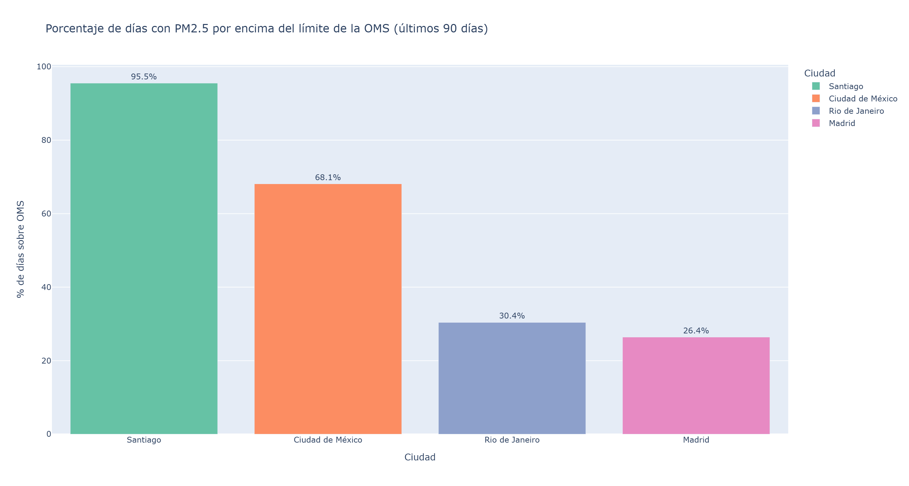
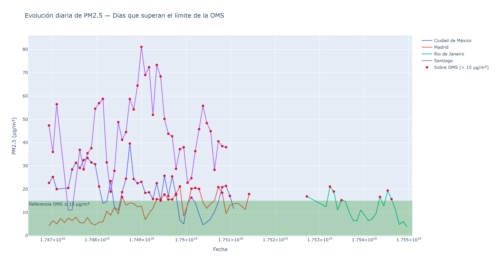

# Análisis de Calidad del Aire en Iberoamérica

Este proyecto analiza datos de calidad del aire, enfocado en los niveles de **PM2.5** en distintas ciudades de Iberoamérica.

## Contenido

- **Mapas interactivos**: Visualización geográfica de la concentración de PM2.5.
- **Gráficos comparativos**: Relación con los límites de la OMS y tendencias temporales.
- **Código reproducible**: Scripts en Python para procesar y visualizar los datos.

---

## Mapa Interactivo

Haz clic para ver el mapa interactivo de PM2.5 publicado en GitHub Pages:

🔗 [Ver mapa interactivo](https://yoccegr.github.io/aire-iberoamerica-90d/mapa_pm25_interactivo.html)

---

## Visualizaciones

### Comparación de % de días sobre el límite de la OMS


### Tendencia de PM2.5 por ciudad


---

## Tecnologías utilizadas

- Python (Pandas, Plotly, Folium, Matplotlib)
- Jupyter Notebook
- GitHub Pages

---

## Cómo ejecutar localmente

```bash
git clone https://github.com/yoccegr/aire-iberoamerica-90d.git
cd aire-iberoamerica-90d
pip install -r requirements.txt
jupyter notebook
